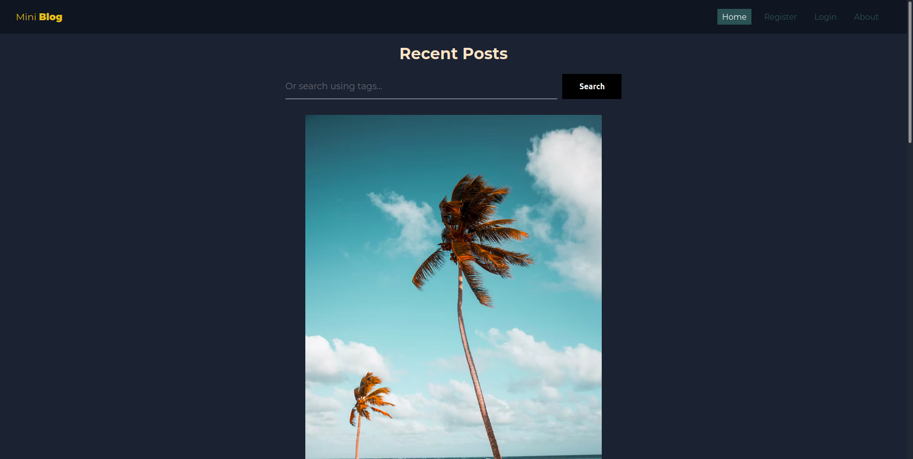
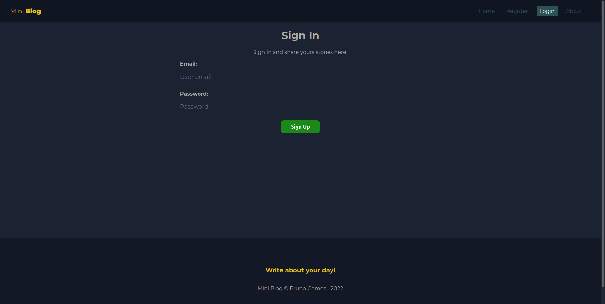
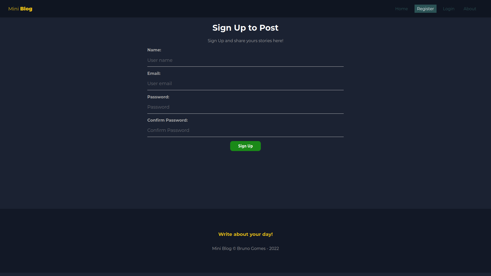
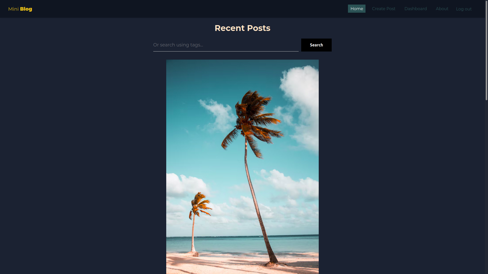
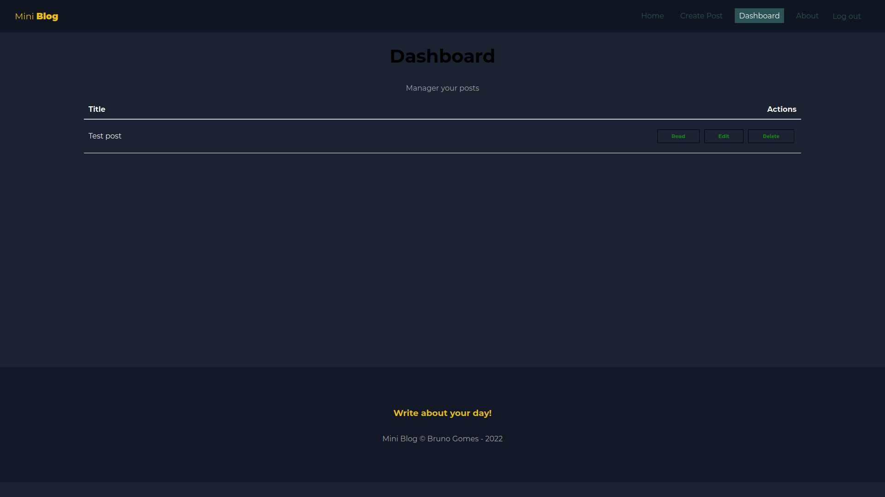
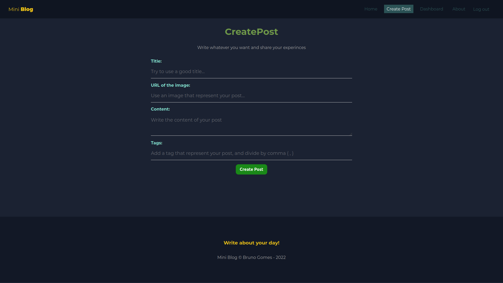

# Mini Blog

<div>
    
    
    
    
    
    
</div>

## About the Project

This is a mini blog that you can post and use an image URL to show whatever you want, being able to search for hashtags and still having a dashboard being able to change your publications and delete, and in the home, you can see all the publications of others users!

### Things you can do:

* Loggin with your email and password saved on Firebase
* Search for posts that has the hashtags that you want to find
* Change your posts, edit the image, the title, the hashtags and the text
* Delete for everyone your posts

## Technologies
- [React](https://pt-br.reactjs.org/)
- [Firebase](https://console.firebase.google.com/u/0/)
- [Redux](https://redux.js.org/)

## Installation

Clone the repo
```sh
git clone https://github.com/brunogomes98/fakeBlog.git
```

### Initializing the project
```bash
# Enter the folder 
$ cd miniblog
# Install the dependencies:
$ yarn or npm i
# Run the aplication
$ yarn start or npm start
```

### Firebase Setup

You need to create a project on firebase console, so after you create you must to check the firebase folder 
there you can see a config_fake.js there has the template taht you can follow
